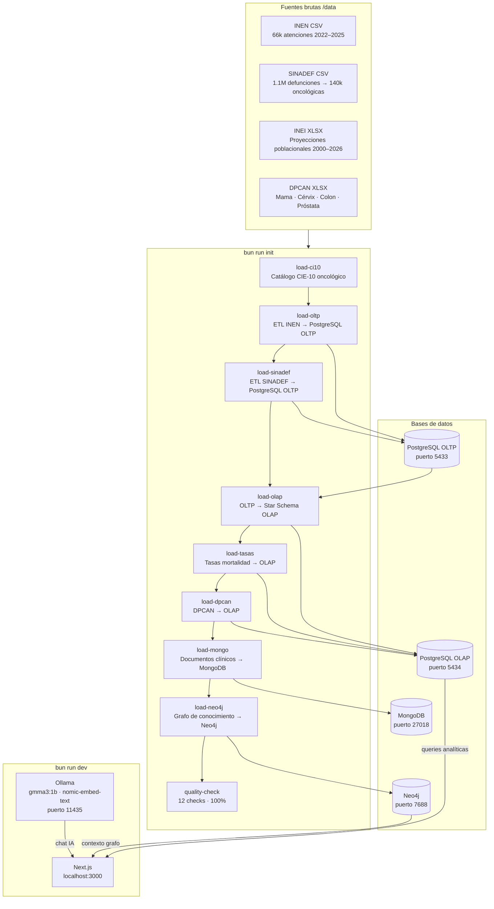
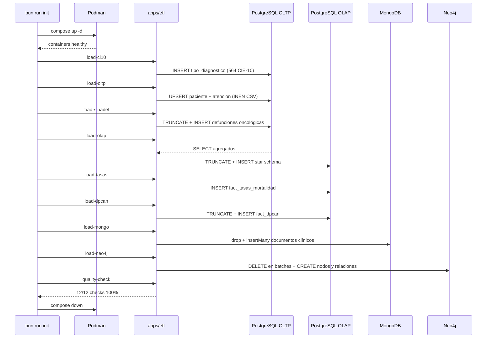
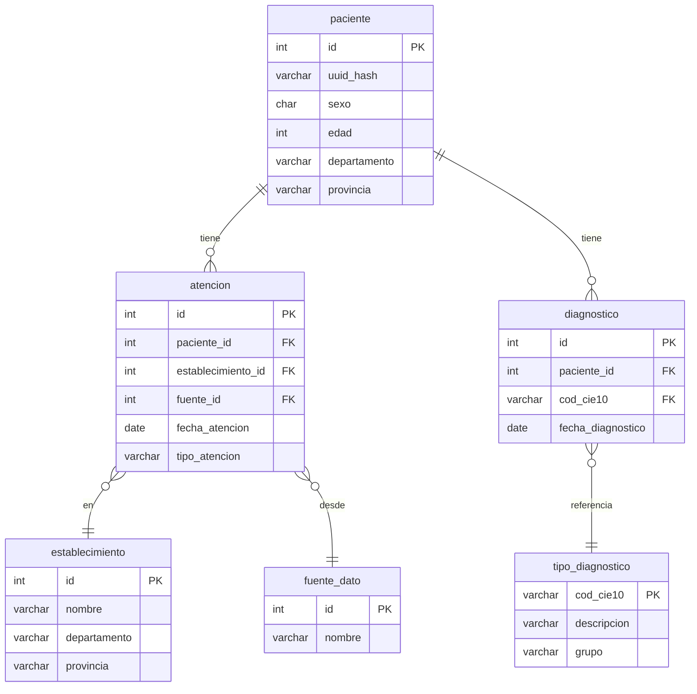
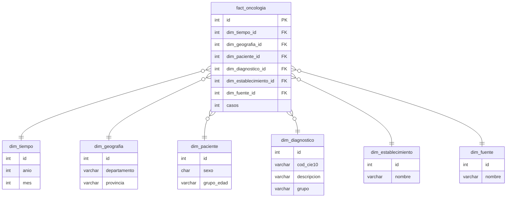
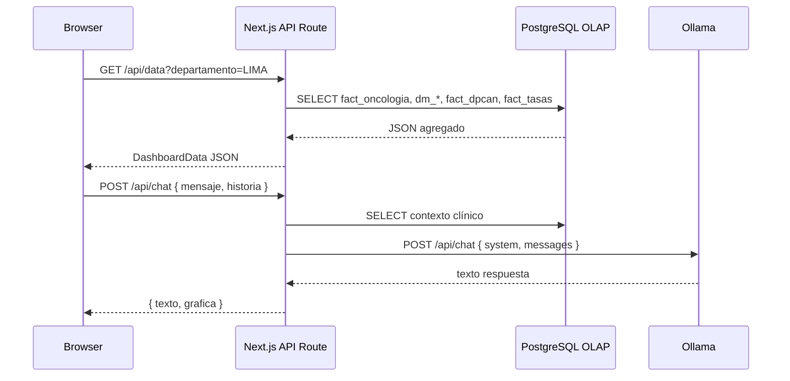

# Oncología Perú — BI Dashboard

Sistema de Business Intelligence para el análisis de datos oncológicos en el Perú, construido sobre fuentes oficiales del INEN, SINADEF, INEI y DPCAN.

---

## Contexto

El cáncer es la segunda causa de muerte en el Perú. Los datos existen — distribuidos en registros hospitalarios, sistemas de defunción y encuestas nacionales — pero sin integración ni herramienta de análisis accesible para quienes toman decisiones.

Este sistema unifica esas fuentes en un pipeline reproducible que termina en un dashboard interactivo con análisis de tendencias, predicciones y cobertura de tamizaje por región.

---

## Arquitectura general



---

## Fuentes de datos

| Fuente | Registros | Período | Formato | Uso |
|--------|-----------|---------|---------|-----|
| INEN | 66,145 atenciones | 2022–2025 | CSV latin-1 | Pacientes oncológicos nuevos |
| SINADEF | 1,134,173 defunciones → 140,513 oncológicas | 2017–2024 | CSV pipe-delimited | Mortalidad por CIE-10 C00–C97 |
| INEI | 300 registros | 2000–2026 | XLSX | Proyecciones poblacionales por departamento |
| DPCAN | 1,365,650 filas | 2022–2025 | XLSX (4 archivos) | Tamizaje: Mama, Cérvix, Colon, Próstata |

---

## Pipeline ETL — `bun run init`

El comando levanta todos los contenedores, ejecuta el pipeline completo y los apaga al terminar. Si cualquier paso falla, los contenedores se apagan y el proceso sale con código 1.

### Secuencia de carga



### Modelo OLTP — 3FN



### Modelo OLAP — Star Schema



### Tablas de hechos adicionales

| Tabla | Filas | Descripción |
|-------|-------|-------------|
| `fact_oncologia` | 338,948 | Hechos centrales INEN + SINADEF |
| `fact_dpcan` | 1,365,650 | Tamizaje por tipo, región, año y sexo |
| `fact_tasas_mortalidad` | 2,100 | Tasas por 100k hab. 2000–2024 |

### Data marts (vistas materializadas)

| Vista | Descripción |
|-------|-------------|
| `dm_geografia` | Casos agregados por departamento y año |
| `dm_demografia` | Distribución por sexo y grupo de edad |
| `dm_temporal` | Tendencia mensual y anual |
| `dm_diagnostico` | Top diagnósticos por región |

---

## Grafo de conocimiento — Neo4j

### Nodos

| Label | Cantidad | Propiedades clave |
|-------|----------|-------------------|
| `Paciente` | 206,656 | `hash`, `sexo`, `departamento` |
| `TipoCancer` | 564 | `cod_cie10`, `descripcion` |
| `Departamento` | 25 | `nombre`, `zona` |
| `Provincia` | 217 | `nombre` |
| `FactorRiesgo` | 9 | `nombre` |

### Relaciones

| Relación | Cantidad | Descripción |
|----------|----------|-------------|
| `DIAGNOSTICADO_CON` | 140,513 | Paciente → TipoCancer |
| `RESIDE_EN` | 139,389 | Paciente → Departamento |
| `PERTENECE_A` | 197 | Provincia → Departamento |
| `TIENE_INCIDENCIA` | 500 | Departamento → TipoCancer |
| `PRESENTA_FACTOR` | 100 | Departamento → FactorRiesgo |

---

## Dashboard — `bun run dev`

Levanta solo `postgres_olap` + `ollama`. Al presionar Ctrl+C ambos contenedores se apagan automáticamente.

### Flujo de una request



### Pestañas del dashboard

| Pestaña | Fuente OLAP | Qué muestra |
|---------|-------------|-------------|
| Tendencia | `dm_temporal` | Atenciones por año con subtítulo explicativo |
| Demografía | `dm_demografia` | Distribución por sexo y grupo de edad |
| Provincias | `dm_geografia` | Casos por provincia del departamento seleccionado |
| Predicciones | `fact_tasas_mortalidad` | Proyecciones 2025–2027 con regresión lineal |
| Tipos | `dm_diagnostico` | Top 15 diagnósticos oncológicos por región |
| Tamizaje | `fact_dpcan` | Cobertura de detección temprana por tipo de cáncer |

---

## Inicio rápido

**Primera vez — poblar las bases de datos:**

```bash
bun run init
```

**Desarrollo diario:**

```bash
bun run dev
```

---

## Requisitos

- [Bun](https://bun.sh) ≥ 1.3
- [Podman](https://podman.io) + podman-compose
- Archivos de datos en `data/` (no incluidos en el repositorio)

---

## Tecnologías

- Next.js · React · TypeScript · Tailwind CSS · shadcn/ui · Recharts
- PostgreSQL (OLTP + OLAP) · MongoDB · Neo4j
- Ollama (gemma3:1b · nomic-embed-text)
- Bun · Podman

---

*by clix*
